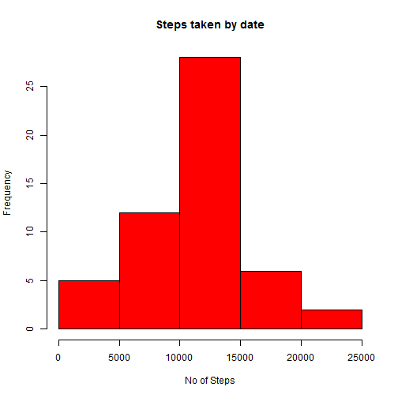
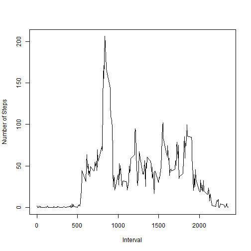
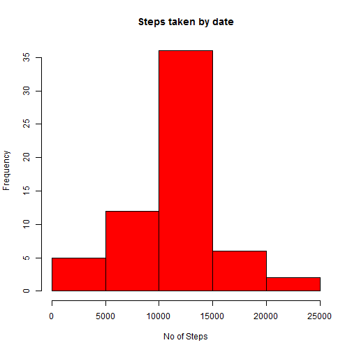
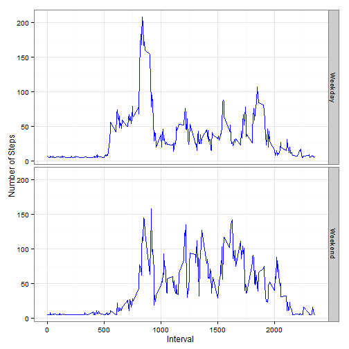

#Peer Assignment
    This document will give the detailed analysis on the peer assignment 1 for reproducible research.

##Loading and Preprocessing the data

    The below will give the code for reading the analysis data.

```r
    library(knitr)
    library(ggplot2)

    ds <- read.csv(unz("activity.zip","activity.csv"))
    ds$date <- as.Date(ds$date) 
```

##Analysis on total number of steps taken per day


    The below part will give the analysis on the total number of steps taken per day.

```r
    daily_steps <-  aggregate(ds$steps,by=list(ds$date),sum)   
    colnames(daily_steps)<-c("Date","No_of_Steps")
    hist(daily_steps$No_of_Steps,main = "Steps taken by date",col = "red",xlab = "No of Steps")
```

 


##Mean and Median of the total number of steps taken per day


```r
    summ <- summary(daily_steps$No_of_Steps)
    summ <- as.data.frame(cbind(summ[3],summ[4]))
    colnames(summ) <- c("Median","Mean")
    row.names(summ) <- NULL
    kable(summ,caption=" Median and Mean of the total number of steps taken per day")
```


| Median|  Mean|
|------:|-----:|
|  10760| 10770|

##Average daily activity pattern

```r
    ds_missing <- complete.cases(ds)
    ds_clean <- ds[ds_missing,]
    ds_Average_Activity<-aggregate(ds_clean$steps,by=list(ds_clean$interval),mean)
    colnames(ds_Average_Activity) <- c("interval","No_of_Steps")
     plot(x = ds_Average_Activity$interval,y = ds_Average_Activity$No_of_Steps,type="l",xlab = "Interval",ylab = "Number of Steps")
```

 
    The below table gives the time interval for which the average steps taken is maximum


```r
    max_interval <-ds_Average_Activity[which(ds_Average_Activity$No_of_Steps==max(ds_Average_Activity$No_of_Steps)),]
    rownames(max_interval)<- NULL
    kable(max_interval,digits = 0)
```


| interval| No_of_Steps|
|--------:|-----------:|
|      835|         206|
    
##Missing Values analysis 

```r
    ## Reporting missing values
    missing_values <- as.data.frame(length(ds_missing[ds_missing==TRUE]))
    colnames(missing_values) <- c("Missing Values")
    kable(missing_values)
```


| Missing Values|
|--------------:|
|          15264|

##Imputing of missing data
    We are inputing the missing data by replacing the NA values with mean of the five minute interval.
    

```r
    ##Imputing the missing values with mean 
    mean_value <- mean(ds$steps,na.rm = TRUE)
    ds_new <- rbind(ds)
    ds_new$steps[is.na(ds_new$steps)] <- mean_value
```

#Analysis after Missing data imputed

##Analysis on total number of steps taken per day 


    The below part will give the analysis on the total number of steps taken per day.

```r
    daily_steps <-  aggregate(ds_new$steps,by=list(ds_new$date),sum)   
    colnames(daily_steps)<-c("Date","No_of_Steps")
    hist(daily_steps$No_of_Steps,main = "Steps taken by date",col = "red",xlab = "No of Steps")
```

 

##Mean and Median of the total number of steps taken per day


```r
    summ <- summary(daily_steps$No_of_Steps)
    summ <- as.data.frame(cbind(summ[3],summ[4]))
    colnames(summ) <- c("Median","Mean")
    row.names(summ) <- NULL
    kable(summ,caption=" Median and Mean of the total number of steps taken per day")
```


| Median|  Mean|
|------:|-----:|
|  10770| 10770|

##Impact of Imputation
    
    The imputation of missing values has increased the median . After the imputation the mean and median are same.So this has become a normal distribution.
    
##Weekdays and Weekend Analysis


```r
    ds_new$day <- weekdays(ds_new$date)
    ds_new$day[ds_new$day=="Sunday" | ds_new$day =="Saturday"] <- "Weekend"
    ds_new$day[ds_new$day!="Weekend" | ds_new$day !="Weekend"] <- "Weekday"
```

##Average daily activity pattern by weekday and Weekend

```r
   ds_Day_Average<-aggregate(ds_new$steps,by=list(ds_new$interval,ds_new$day),mean)
 
    colnames(ds_Day_Average) <- c("Interval","Day","No_of_Steps")

    ggplot(ds_Day_Average,aes(x=Interval,y = No_of_Steps))+labs(x="Interval",y="Number of Steps")+geom_line(col="Blue")+theme_bw()+facet_grid(Day~.)
```

 
